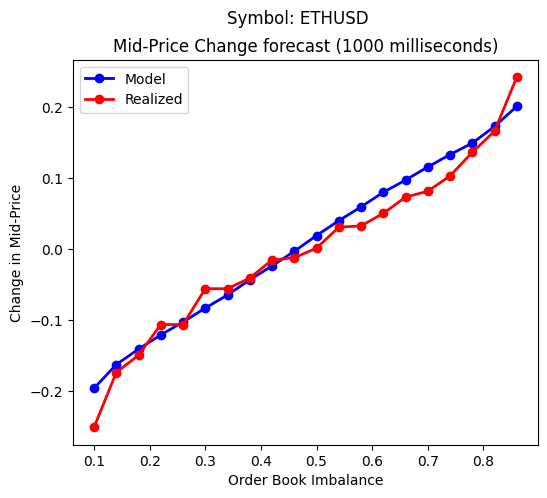

# microprice-calibration

The Micro-Price (Stoikov, 2017) is a high frequency estimator of future prices.
(See: https://papers.ssrn.com/sol3/papers.cfm?abstract_id=2970694)

### What does this code do?
This repository contains source code that calibrates Stoikovs Micro-Price model to BitMEX quote data and creates optimal limit order postings at the best bid and offer using stochastic optimal control and by solving HJB-QVI equation.

### Micro-Price

The weighted mid-price is a noisy and counter-intuitive measure of the "fair-value" of a traded asset. The Micro-Price is the expected
mid-price in the future given a Markov-Chain that drives the future evolution of mid-price using Euler finite difference scheme.

### Market Making Strategy

The Micro-Price may be combined with stochastic optimal control to create a market making strategy that accounts for the micro-price as a short-term
prediction of the asset price. For a mathematical treatment see: https://gist.github.com/sebjai/c6ff3850dea37d28d3fa7d3aef59722b

